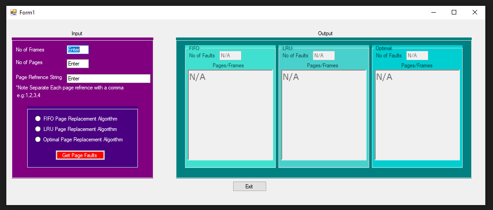

# Memory-scheduling-algorithms
Simple Memory Schelduin Algorithms Demonstration Using C#
### Algorithms:
*FIFO  
*LRU  
*Optimal Page
### Instructions
1- Enter Number Of frames  
2- Enter No Of Pages  
3- Enter Pages Itself _**Separated by Commas**_  
4- Select the Needed Algorithm  
#### The output will be the number of faults and the page order itself.

